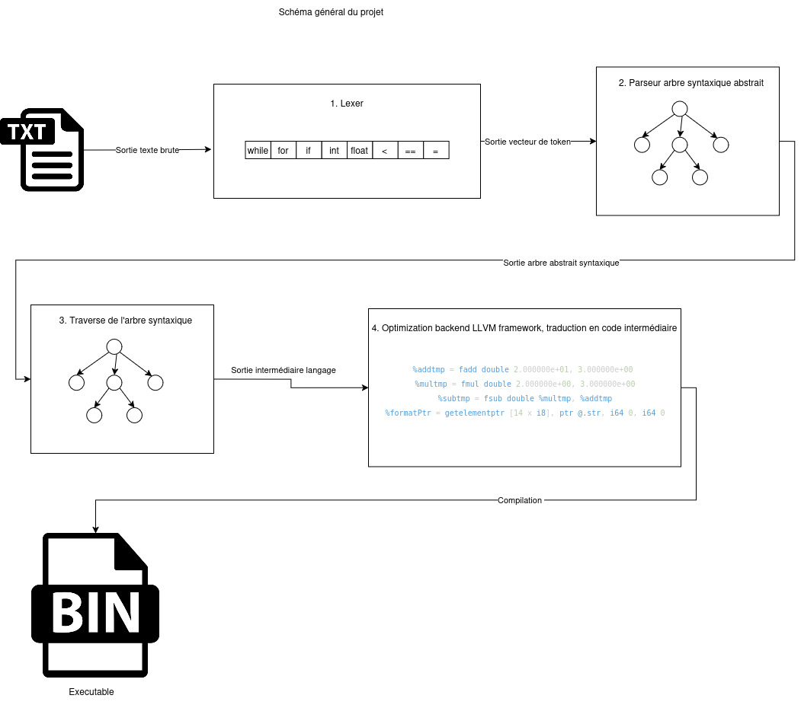

# Prysma: Rapport d’analyse fonctionnelle et organique

**Auteur :** Raphael Arseneault  
**Cours :** Épreuve Synthèse de programme (420-626-RK)

**Présenté à :**
- Monsieur Charles Lemaire
- Monsieur Jonathan Roy
- Monsieur Marcel Landry

**Département de techniques de l’informatique**  
*Cégep Rimouski*  
*25 mars 2026*

Analyse Fonctionnelle
## Diagramme de séquence fonctionnel 

 

## Flux d'Exécution Frontend : Génération de l'AST

Ce diagramme de séquence détaille l'architecture de la phase frontend du compilateur Prysma. L'objectif est d'isoler les responsabilités pour garantir une structure de données stable avant la génération de code intermédiaire LLVM IR.
Composants et Interactions

    Main : Contrôleur central. Il orchestre le flux séquentiel sans exécuter de logique d'analyse.

    LecteurFichierTexte : Extrait le code brut du fichier source et retourne une std::string.

    Lexer : Analyse le texte et génère un vecteur de tokens (analyse lexicale).

    Curseur : Constructeur de l'arbre. Reçoit les tokens et initie l'analyse syntaxique.

    Noeud : Représente la logique de l'Arbre Syntaxique Abstrait (AST). La construction s'effectue par récursivité, chaque nœud instanciant et évaluant ses enfants selon la grammaire de Prysma.

Contrainte architecturale

L'AST généré est renvoyé au Main uniquement s'il est complet. Cette isolation stricte des couches applique le principe de Fail-Fast. En cas d'erreur de syntaxe détectée par le Lexer ou le Curseur, la compilation s'arrête immédiatement, empêchant toute corruption de la mémoire et garantissant que l'API C++ de LLVM ne reçoive qu'un arbre syntaxique 100% valide.

## Schéma général du projet

## Description détaillée de l’algorithme
On commence par traiter un fichier texte contenant le code source Prysma. Il est chargé en mémoire et envoyé au lexer. Le lexer se charge de transformer le fichier texte en vecteur de tokens, chaque token contient un identifiant et une string value. Il sépare mot à mot chaque token en lui attribuant son propre identifiant. Tout superflu n’est pas traité par le lexer : espaces, caractères invalides non disponibles dans le langage s’il y a lieu. Ensuite, le vecteur de tokens est envoyé vers le parseur, la classe curseur sera en charge de parcourir le vecteur de tokens avec l’algorithme de descente récursive pour construire l’arbre approprié avec les nœuds conformes pour celui-ci. Un arbre syntaxique complet en sortira. Ensuite, dans le main, l’utilisation du parcours en profondeur sera utilisée pour parcourir récursivement l’arbre syntaxique abstrait, chaque nœud pourra alors construire le code intermédiaire en utilisant le framework LLVM. Le backend LLVM se chargera de traduire le code intermédiaire en code assembleur, puis en code machine exécutable.

## Cas de tests fonctionnels

Les cas de tests, situés dans le répertoire `/Tests/PrysmaCodeTests/`, ont pour objectif de valider individuellement les fonctionnalités critiques du compilateur Prysma. Chaque fichier `.p` représente un scénario de test autonome qui vérifie un aspect spécifique du langage, de la déclaration des variables à des opérations complexes comme la récursivité et la manipulation de tableaux. L'approche est de garantir que chaque composant du compilateur fonctionne comme attendu avant de les intégrer.

### TestFonctionnelVariableInt.p
Ce cas de test se concentre sur la validation des opérations arithmétiques et de la logique de base pour les variables de type entier (`int32`). L'objectif est de confirmer que le compilateur gère correctement la priorité des opérateurs (multiplication avant addition), les affectations de variables, l'auto-incrémentation (`a = a + 1`), et la copie de valeurs entre variables. Il vérifie également que les arguments de fonction sont correctement passés et que les expressions complexes avec parenthèses sont évaluées dans le bon ordre.

### TestFonctionnelVariableFloat.p
Similaire au test sur les entiers, ce fichier valide les mêmes fonctionnalités mais pour les variables à virgule flottante (`float`). Il s'assure que la précision des calculs est maintenue et que les opérations de base (priorité, affectation, passage d'arguments) sont conformes aux attentes pour les nombres décimaux.

### TestFonctionnelVariableBool.p
Ce test est dédié à la manipulation des variables booléennes (`bool`). Il a pour but de vérifier la correction des opérateurs logiques `&&` (ET), `||` (OU), et `!` (NON). Les tests couvrent des scénarios où les opérateurs sont utilisés avec des valeurs littérales (`true`, `false`) ainsi qu'avec des variables, garantissant que la logique booléenne du langage est solide.

### TestCondition.p
L'objectif de ce cas de test est de valider le comportement des structures conditionnelles `if-else`. Il teste une variété de conditions, incluant des comparaisons sur les entiers et les flottants (`>`, `<`, `==`), des opérateurs logiques (`&&`, `||`), et des conditions imbriquées. Un test critique vérifie que les parenthèses dans les conditions complexes sont correctement interprétées par le parseur.

### TestBoucle.p
Ce fichier a pour but de tester la fonctionnalité des boucles `while`. Il couvre des scénarios de base, comme une boucle simple avec un compteur, des boucles imbriquées, et des conditions de sortie plus complexes utilisant des opérateurs logiques. Un cas spécifique s'assure qu'une boucle dont la condition est initialement fausse ne s'exécute jamais.

### TestRecursivité.p
Ce cas de test a pour objectif de valider la capacité du compilateur à gérer des appels de fonction récursifs. Il implémente deux algorithmes classiques, la factorielle et la suite de Fibonacci, pour s'assurer que la pile d'appels est correctement gérée et que les fonctions peuvent s'appeler elles-mêmes sans provoquer de corruption de la mémoire ou de boucle infinie.

### TestTableauInt.p, TestTableauFloat.p, TestTableauBool.p
Ces trois fichiers de test sont dédiés à la validation de la gestion des tableaux pour chaque type de données de base. Leur objectif est de confirmer que la déclaration, l'affectation, et la lecture des éléments de tableau fonctionnent correctement. Les tests incluent l'utilisation d'index statiques et dynamiques (variables ou expressions), la vérification de l'intégrité de la pile mémoire lors des accès au tableau, et la capacité de passer des tableaux en argument de fonction et de les retourner. Un cas de test important vérifie également que l'accès à un index en dehors des limites du tableau est correctement géré, bien que ce test soit actuellement commenté car il devrait provoquer une erreur de compilation.

# Identification des cas limites

C'est l'analyse des situations extrêmes pour les algorithmes critiques du compilateur Prysma. L'objectif est de garantir la robustesse du système face à des données inattendues et de prévenir les erreurs de segmentation (Segmentation Fault) sur le chemin critique de la compilation.

### 1. Construction de l'arbre d'équation — ConstructeurArbreEquation::construire()
**Description :** C'est le composant le plus vulnérable aux entrées syntaxiques invalides lors de la résolution mathématique.
**Cas limite 1 :** Parenthèses vides `()` ou asymétriques dans l'expression.
**Action/Résolution :** Le `ServiceParenthese` traite le vecteur de tokens. Si l'expression résultante est vide, l'algorithme lance immédiatement une exception. C'est une protection directe contre les accès pointeurs invalides. L'arbre n'est pas construit.
**Cas limite 2 :** Opérateurs consécutifs sans opérande (ex: `5 + * 3`).
**Action/Résolution :** La `ChaineResponsabilite` divise l'expression, isolant un opérateur orphelin. La méthode `convertirEnFloat()` échoue sur l'évaluation du cas de base. L'algorithme rejette la syntaxe et lance une exception sémantique au lieu de générer une instruction LLVM IR corrompue.

### 2. Compilation multi-fichier parallèle — OrchestrateurInclude::compilerProjet()
**Description :** C'est la gestion de la stabilité du multithreading et de l'intégrité de la mémoire lors de la passe d'analyse.
**Cas limite 1 :** Dépendances circulaires (Le fichier A inclut le fichier B, qui inclut le fichier A).
**Action/Résolution :** Le `RegistreFichier` valide chaque inclusion via un `std::set` protégé par un `std::mutex`. Si l'empreinte du fichier est présente, le thread ignore l'instruction. Résout le problème de création infinie de threads et prévient le dépassement de la pile (Stack Overflow) et la saturation de la RAM.
**Cas limite 2 :** Erreur fatale ou exception levée dans un seul thread parmi les N fichiers.
**Action/Résolution :** Le thread fautif signale l'échec au contexte global. L'orchestrateur maintient la stabilité en appelant `join()` sur les threads restants pour préserver l'intégrité des arènes d'allocation. La seconde passe (génération LLVM) est verrouillée et annulée.

### 3. Analyse lexicale — Lexer::tokenizer()
**Description :** C'est la porte d'entrée des données brutes, responsable de la sécurité de la lecture en mémoire.
**Cas limite 1 :** Fichier source vide (0 octet) ou composé uniquement d'espaces.
**Action/Résolution :** La boucle de lecture atteint la fin du fichier sans générer de symboles. Le `ConstructeurArbreInstruction` reçoit un vecteur vide et ignore la boucle de construction du `Main`. Le compilateur génère un exécutable valide et minimal qui retourne `0`.
**Cas limite 2 :** Chaîne de caractères non fermée en fin de fichier (ex: `string a = "texte`).
**Action/Résolution :** La boucle d'extraction de chaîne valide la condition `index < fichier.taille()` à chaque itération. La fin prématurée du fichier force l'interruption de la boucle avant le guillemet fermant. L'erreur lexicale est signalée, ce qui prévient la lecture hors mémoire (Buffer Overread) et les boucles infinies.