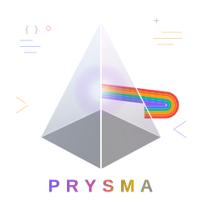

# Prysma Programming Language



[](https://github.com/Zyphorah/Prysma/actions/workflows/ci.yml)
[](https://www.gnu.org/licenses/gpl-3.0)
[](https://isocpp.org/)
[](https://llvm.org/)

Prysma est un langage de programmation système à hautes performances, compilé vers l'infrastructure **LLVM 18**. Le project privilégie un contrôle déterministe des ressources et une architecture modulaire robuste.

## Capacités Techniques

  * **Backend :** Génération de code intermédiaire (IR) via LLVM 18 en forme SSA (Single Static Assignment).
  * **Modèle Object :** Implémentation native des classes, de l'héritage et du polymorphisme dynamique via VTable.
  * **Gestion Mémoire :** Contrôle manuel du tas (heap) via les opérateurs `new` et `delete`. Allocation interne optimisée par **Bump Pointer Allocator** (Arena).
  * **Parallélisme :** Orchestration de la compilation multi-fichier via `llvm::ThreadPool`.
  * **Analyse Statique :** Système de typage fort avec auto-casting sécurisé et détection des dépendances circulaires d'inclusion.

## Architecture du Compiler

Le pipeline de traitement suit une structure linéaire stricte :

1.  **Frontend :** Analyse lexicale (Lexer) et syntaxique par descente récursive.
2.  **Représentation Intermédiaire :** Construction d'un Tree Syntaxique Abstrait (AST) basé sur le patron de conception **Composite**.
3.  **Génération de Code :** Traduction de l'AST vers LLVM IR via le patron de conception **Visitor**.
4.  **Backend :** Optimisations et génération du binaire natif par l'infrastructure LLVM.

## Aperçu de la Syntaxe

```rust
fn int32 main() {
    dec string message = "Système Prysma opérationnel";
    call print(ref message);
    return 0;
}
```

## Programmation orienté object

 - Actuellement en phase expérimentale. Cette partie est incomplète et peut présenter des instabilités.

## Documentation

Conformément à la structure modulaire du project, l'intégralité de la documentation technique et des procédures de configuration est isolée dans le répertoire `/docs`.

  * **Configuration et Installation :** [Docs/Fr/Installation/SETUP_UBUNTU.md](Docs/Fr/Installation/SETUP_UBUNTU.md)
  * **Analyse de l'Architecture :** [Docs/Fr/ARCHITECTURE.md](Docs/Fr/ARCHITECTURE.md)
  * **Analyse de Robustesse et Sécurité :** [Docs/Fr/ROBUSTNESS.md](Docs/Fr/ROBUSTNESS.md)
  * **Spécifications du Langage :** [Docs/Fr/PRYSMA.md](Docs/Fr/PRYSMA.md)
  * **Rapport d'Analyse Technique :** [Docs/Fr/Analyse/CHOIX_TECHNOLOGIQUES.md](Docs/Fr/Analyse/CHOIX_TECHNOLOGIQUES.md)

## Licence

Ce project est distribué sous licence **GPL v3**. Consulter le fichier `LICENSE` pour les détails juridiques.