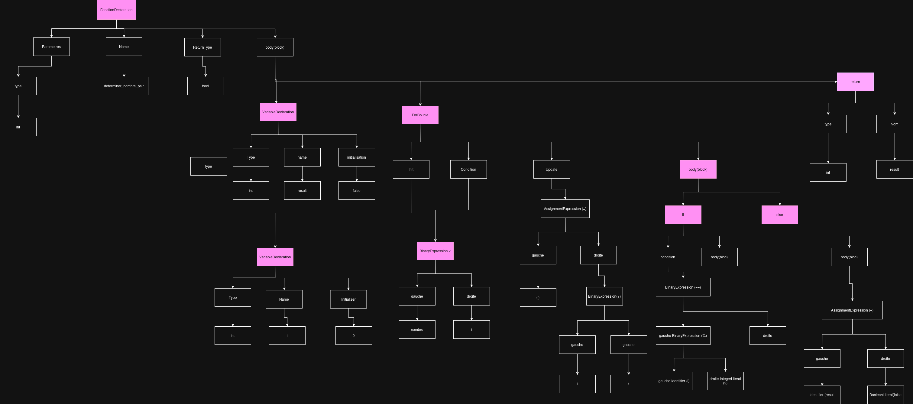
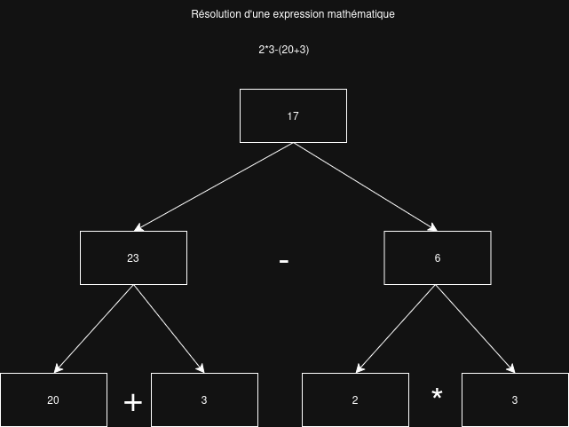

# Prysma

## APPROUVÉ PAR LES PROFS
#### PROF RESPONSABLE: MARCEL

## Description du projet 

C'est un projet de développement d'un compilateur dont l'objectif sera de traduire un langage de programmation de haut niveau vers un langage intermédiaire LLVM. Le framework LLVM est largement utilisé dans l'industrie pour la compilation de code, notamment pour les langages comme le C et le C++ incluant Rust. LLVM sera la partie backend du compilateur, tandis que le frontend sera développé par moi. 

LLVM résout plusieurs problématiques liées au langage de bas niveau, comme l'assembleur. 
 - permet d'optimiser le code généré pour le rendre plus rapide et efficace en termes de mémoire.
 - Permet de cibler plusieurs architectures matérielles différentes sans avoir à réécrire le code assembleur généré pour chaque architecture. 
 - résout le problème de registres limités en utilisant une approche de registres virtuels illimités. Il gère d'ailleurs automatiquement l'allocation des registres physiques, leur stockage en mémoire RAM et les libère lorsqu'ils sont nécessaires.
 - Gère l'aspect privé de la mémoire en isolant les différentes sections, d'ailleurs on a accès à des fonctions générées par LLVM pour séparer la logique. 

En somme, le LLVM est un outil qui génère du code intermédiaire avec une syntaxe proche de l'assembleur, mais avec des fonctionnalités avancées qui facilitent la création du compilateur. 

Prysma est un langage de programmation qui inclura des fonctionnalités de base comme les variables, les fonctions, les conditions, les boucles, etc. Le compilateur devra être capable de gérer ces fonctionnalités et de générer du code LLVM correspondant. L'objectif est de créer un langage Turing-complet, il y aura donc l'écriture de bibliothèques standard comme la gestion de la mémoire, arbre binaire, liste chaînée, pile, file, graphe, dictionnaire, bibliothèque de manipulation de chaîne de caractères, etc. C'est un projet évolutif, donc les fonctionnalités ne sont pas en manque, nous pouvons toujours ajouter des fonctionnalités supplémentaires au langage et au compilateur, exemple : l'orienté-objet, faire un garbage collector, des lambdas, etc.


## 3 projets similaires au mien qui m'inspirent 

 - Rust : langage de programmation système qui met l'accent sur la sécurité et la performance. Il utilise LLVM comme backend pour la compilation. C'est un langage très solide et a fait ses preuves dans l'industrie. D'ailleurs, le langage est à une maturation avancée, le compilateur est écrit en Rust lui-même, pour bénéficier de ses propres fonctionnalités de sécurité mémoire, c'est une démonstration de fiabilité, construire un gros projet montre sa robustesse. 
 URL du projet GitHub : https://github.com/rust-lang/rust.git

 - Kaléidoscope : un langage de programmation éducatif, développé par l'équipe LLVM pour enseigner les concepts de base de la compilation en utilisant LLVM comme backend. C'est un bon exemple qui montre les étapes pour construire un compilateur fonctionnel. Toutes les étapes sont expliquées et documentées, ce qui facilite la compréhension. URL du tutoriel : https://llvm.org/docs/tutorial/MyFirstLanguageFrontend/

- GCC : un compilateur open-source très populaire, il permet de compiler le C, C++, Fortran, etc. Il est largement utilisé dans l'industrie, c'est un projet mature et robuste. Intéressant de le voir pour comprendre la construction d'un compilateur évolué. Bien que les parties soient très complexes. URL du projet GitHub : https://github.com/gcc-mirror/gcc.git

## Contrainte d'acceptation

### Deux aspects technologiques majeurs du projet

| Aspect technologique |
| -------------------- |
| Algorithmique        | 
| Outils de compilation|

### Apprentissage technique qui sera réalisé avec la création de ce projet

LLVM : 
    Le projet utilisera le framework LLVM pour la génération de code intermédiaire. L'apprentissage portera sur l'utilisation de l'API C++ de LLVM pour créer des modules, des fonctions, des blocs de base et des instructions. Il sera également nécessaire de comprendre comment manipuler les types de données, les constantes et les variables dans LLVM. De plus, l'optimisation du code généré sera un aspect important à maîtriser pour améliorer les performances du compilateur.
URL : https://llvm.org/

Compilateur : 
    L'apprentissage se portera sur la construction d'un compilateur de A à Z. Cela inclut la compréhension des différentes phases de compilation, telles que l'analyse lexicale, l'analyse syntaxique, la génération de code intermédiaire et l'optimisation. Je dois comprendre comment construire un arbre syntaxique abstrait (AST) pour représenter la structure du code source, et comment traduire cet AST en code LLVM. De plus, il sera important de maîtriser les techniques pour gérer les erreurs de syntaxe et de sémantique dans le code source. 
URL : https://llvm.org/docs/tutorial/MyFirstLanguageFrontend/

#### Façon dont la technologie sera intégrée au projet

Cette technologie s'intègre au projet en tant que composant central, c'est le backend du compilateur. C'est la pièce qui permet la génération du code intermédiaire LLVM IR, un langage de programmation assembleur évolué pour faciliter la programmation d'un langage de programmation. Cette technologie sera utilisée pour générer le code intermédiaire pour la génération de la résolution d'une équation, ex : 20+42-432*(32-432)/3. Toute la syntaxe du langage de programmation, (if, else, for, while, <, = , == , >), utilisera cette technologie pour construire la logique qui sera compilée en assembleur par clang "NomFichier.ll" -o "sortieBinaire". 

### Les risques technologiques pour la réalisation du projet

Points de blocage potentiels :
- Le débogage n'est pas seulement fait dans le langage C++ mais aussi dans le langage généré par le framework LLVM. Ce qui nous donne deux dimensions de débogage où peut se trouver un problème. 
- La complexité de la génération du code par le framework LLVM peut être importante. 
- La récursivité peut être un défi, visualiser l'état d'exécution du code n'est pas aussi simple qu'avec un code non récursif. 
- La gestion de la mémoire peut être un défi, surtout dans le langage C++ et Prysma.
- La création du garbage collector peut être un défi technique intéressant à relever. 
- La création des bibliothèques du langage Prysma.

Défis techniques pour mener à terme la réalisation :
- Comprendre en profondeur le framework LLVM et son API C++.
- Concevoir une architecture de compilateur robuste et évolutive.
- Gérer les erreurs de syntaxe et de sémantique de manière efficace.
- Optimiser le code généré pour de meilleures performances.

## Illustration du projet

C'est la représentation d'un arbre syntaxique abstrait pour le langage Prysma. Pour le code suivant :

```
fn void afficher_nombre_pair(int32 limite) {
    for (int32 i = 0; i < limite; i = i + 1) {
        if (i % 2 == 0) {
            // Est un nombre pair
            print(i)
        }
        else 
        {
            // Est un nombre impair
            print(i)
        }
    }
}
```




Représentation de la génération du code intermédiaire LLVM IR pour une résolution d'équation simple : 2.0*3.0-(20.0+3.0). Cet algorithme sera utilisé dans les variables ou tout endroit où j'ai besoin de faire un calcul arithmétique. 



code généré en sortie du compilateur Prysma pour cette équation : 2.0*3.0-(20.0+3.0)

```
 %addtmp = fadd double 2.000000e+01, 3.000000e+00
  %multmp = fmul double 2.000000e+00, 3.000000e+00
  %subtmp = fsub double %multmp, %addtmp
  %formatPtr = getelementptr [14 x i8], ptr @.str, i64 0, i64 0
```

## Contenu de vos sprints

### Itération 1 du projet fonctionnalités à réaliser en 2 semaines ?

- Lire des fichiers sources Prysma et les traiter comme du texte
- Supporter les types entiers (int), flottants (float), booléens (bool)
- Compiler les opérations arithmétiques de base (+, -, *, /) vers du code LLVM
- Permettre au développeur de déclarer des variables et les utiliser dans des expressions
- Valider la syntaxe du code et rejeter les structures invalides via la construction de l'AST
- Supporter les fonctions récursives et un type de retour. 
- Signaler les erreurs de syntaxe précisément (numéro de ligne, type d'erreur) plutôt que planter silencieusement
- Ajouter la coloration syntaxique du langage Prysma dans Visual Studio Code

### Itération 2 du projet fonctionnalités à réaliser en 2 semaines ?

- Exporter l'AST en format texte et graphique (Graphviz) pour faciliter le débogage
- Refonte complète de la gestion mémoire pour une performance maximale
- supporter les  opérantes && || == != % 
- Supporter l'instruction if, 
- Supporter l'instruction while, passer par la pile avec alloca
- Supporter les tableaux programmés en LLVM IR 
- Supporter le type string
- Supporter les includes, en utilisant les techniques du langage de programmation C #include "racine/fichier.h"
- Mettre en place un système de compilation multi-thread performant

### Itération 3 du projet fonctionnalités à réaliser en 2 semaines ?

- Supporter l'approche orientée objet avec des classes, polymorphisme fait avec une vtable. 
 - Le Layout de Données (La Structure)
 - Les Contrôles d'Accès (Visibilité)
 - l'Encapsulation et le Pointeur this
 - Le Cycle de Vie (Constructeurs & Destructeurs)
 - L' Héritage (La Hiérarchie de Classes) 
 - Le Polymorphisme (La VTable)

- Écrire une bibliothèque de structures de données (listes chaînées, arbres binaires, piles, files) 

- Utiliser le malloc pour la gestion de la mémoire dynamique et le free libération de la mémoire, depuis la librairie standard de C 
- Faire un système d'import pour permettre d'importer des bibliothèques externes du langage C dans le langage Prysma, c'est une automatisation au lieu de le faire manuellement. 


### Fonctionnalités Bonus (Si le temps le permet)

- Ajouter la gestion manuelle de la mémoire avec les pointeurs pour un contrôle bas niveau
- Fournir des fonctions natives pour les calculs avancés (puissance, PGCD, vérification de nombres premiers)
- Supporter la (Factorielle, Fibonacci) avec une gestion appropriée de la pile d'exécution
- Faire une forêt de syntaxe abstraite compilé chaque fichier séparément pour permettre la compilation de gros projets
- Faire un système de cache pour éviter de recompiler les fichier qui n'on pas été modifié, utiliser un hash du contenu du fichier pour vérifier s'il a été modifié ou pas.
- L'Assembleur en ligne (asm) pour permettre d'inclure du code assembleur directement dans le code source Prysma, ce qui permettrait de controller directement le cpu. 
- Faire un enum class pour les types de données. 
- Ajouter un système de compile time pour permettre d'exécuter du code au moment de la compilation. 
- Ajouter un système de macro pour permettre de faire du code générique.
- Système de Modules et Namespaces pour organiser le code en différentes unités de compilation et éviter les conflits de noms.
- Supporter les fonctions lambda pour permettre de faire des fonctions anonymes et de la programmation fonctionnelle.
- La Généricité (Templates / Generics) 
- méta programmation pour permettre d'exécuter du code au moment de la compilation, ce qui permettrait de faire des optimisations au moment de la compilation.
- Compilation just in-time (JIT) pour permettre d'exécuter du code directement sans passer par la phase de compilation, ce qui permettrait de faire du scripting avec le langage Prysma.

- Analyse syntaxique abstraite pour la logique du langage Prysma, ce qui évitera les problèmes de logique sémantique exemple : declare int a = "string"; 